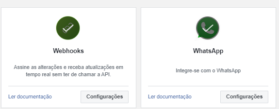
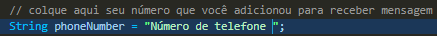

#  API WHATSAPP EXEMPLO

Este é um exemplo de envio de  mensagem utilizando a api do whatsapp,vou mostrar passo a passo como você pode enviar uma mensagem utilizando a api do whatsapp utilizando a linguagem java
Exemplo da mensagem que você pode enviar 
 17.59.26_b4d80be4.jpg>)

## Visão Geral  

Este repositório tem como objetivo mostrar o desenvolvimento de um projeto de chatbot em que estou desenvolvendo para atendimento via whatsapp utilizando a API do whatsapp.
vai ser uma breve apresentação de como está o projeto em que estou desenvolvendo com um simples gerenciador de sistema como fron-end e um exemplo utilizando o chatbot (o repositório desse projeto está privado ) ,porém esse em questão é um exemplo simples para ajudar quem está querendo ter uma ideia de como se utilizar a API do whatsapp.

## Front-end com dashboard para fazer análise de pedidos diários.
 12.31.35_5a3dfdd0.jpg>)

## Opção para consultar os pedidos por dia visualizando todos os pedidos feitos em determinado dia .
 12.32.43_3015fe3a.jpg>)

## Selecionando o dia.
 12.33.12_6c57d9e0.jpg>)

## Visualizando o pedido e clicando no botão de item para visualizar os itens do pedido e exibido o total do pedido
 12.34.30_f2850c82.jpg>)

## Demostração do chatbot com o Gerenciador do sistema

## Passos para utilizar o código desse repositório 
1. Siga os passos iniciais recomendados na documentação 
https://developers.facebook.com/docs/whatsapp/cloud-api/get-started

2. Crie a conta empresarial da meta e siga os passos para a criação de um app (entre com sua conta do facebook)! https://business.facebook.com/business/loginpage/?next=%2F&login_options%5B0%5D=FB&cma_account_switch=0&is_workplatform=0&is_targeting_other_login_options=0&is_from_invitation_flow=0

2. Vá até aplicativo e crie um aplicativo ,caso tenha dificuldade existem alguns vídeos ensinando a criar é simples ,não desista (Tome cuidado para sua conta do facebook não ter nenhuma restrinção se não pode ser dificil de conseguir seguir os passos)!

3. Procure por esse painel ao entrar no aplicativo e seguir o passo a passo de nomear o  aplicativo e adicionar o número de telefone 

4. Caso não tenha adicionado o webhook ou whatsapp adicione ao aplicativo

5. Dentro do painel procure por whatsapp e selecione configurações da api!

6. Verifique o token de verificação que é atualizado automaticamente em 24 horas copie e cole no código.

7. Adicione o número para teste que a meta vai disponibilizar no etapa 1

8. Pegue o número de identificação e adicione no código 

9. Adicione um número de telefone para receber as mensagens

10. Após isso pegue o número que adicionou e adicione no código

11. Pode rodar o código utilizando o code runner extensão do vs code ou utilize o terminal 

## Espero que o Readme tenha ajudado ,muito obrigado !